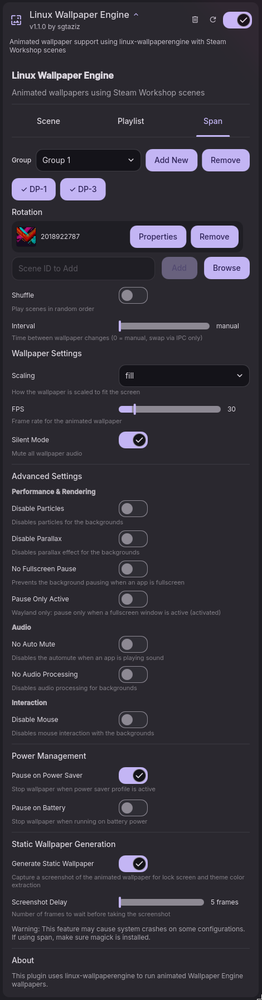

# DMS-WallpaperEngine

A [DankMaterialShell](https://github.com/AvengeMedia/DankMaterialShell) plugin for [linux-wallpaperengine](https://github.com/Almamu/linux-wallpaperengine).



## Installation

### Pre-requisites
1. Install [linux-wallpaperengine](https://github.com/Almamu/linux-wallpaperengine).

### From Plugin Registry (Recommended)
1. Open DMS Settings
2. Go to Plugins tab
3. Click Browse
4. Click "Show 3rd Party Plugins" and confirm.
5. Search for Linux Wallpaper Engine

### Manual Installation
```bash
# Copy plugin to DMS plugins directory (create it if it doesn't exist)
cp -r LinuxWallpaperEngine ~/.config/DankMaterialShell/plugins/

# Enable in DMS settings under Plugins tab.
```

## Features

### The active tab is the global config type
The settings page has three tabs, and the tab you're on is the **one global config type that renders** — the others are fully ignored (but stay saved):
- **Scene** — only per-monitor static scenes render (one per monitor; `*` is the default for unconfigured monitors).
- **Playlist** — only per-monitor playlists render (rotating scenes, with shuffle/interval).
- **Span** — only span groups render (one wallpaper stretched across multiple monitors, with its own scene or rotation + shuffle/interval).

So if you have a scene configured and switch to the Span tab, the scene stops rendering and only span groups render — switch back to Scene and it returns. Nothing is erased; the tab just selects which type is active. The active tab is remembered, so reopening settings highlights the same tab. (To run a single scene under the Span tab, make a 1-monitor span group.)

The **Scene** tab shows a large preview of the current scene. The **Playlist** and **Span** tabs show a table of the rotation's scenes (thumbnail + scene id + Properties + Remove), with Browse and an add-by-ID field below.

### Wallpaper picker and named playlists
The unified picker provides a searchable scene grid, named playlists, span groups, per-playlist interval and shuffle settings, and persistent scroll positions. It serves both hosts: the settings page's **Browse** buttons open it in a minimal scene-only form (playlist/span sections hidden), and the daemon exposes the full picker through the `picker` IPC commands. Double-click a scene to apply it to the picker's target, or a non-empty playlist / span group to activate it.

**Targets.** The picker always applies to one owner: a single monitor, `*` (all monitors without their own config), or — when browsing from the settings Span tab — a span group. The header chip shows the current target. The `picker` IPC command auto-targets the monitor the picker opens on; use `pickerMonitor "*"` to target all monitors instead. Picking a single scene switches to scene mode, activating a playlist switches to playlist mode, and activating a span group switches to span mode. **Apply to All** sets the scene on `*` *and clears per-monitor scene overrides*, so every monitor renders it — the only picker action that wipes per-monitor config.

**Named playlists** are shared lists of scenes. Using one on a target *copies* its scenes into that target's rotation (the monitor's playlist, or a span group's inline playlist) and remembers the source name — so the picker can badge the active playlist, and the target's interval/shuffle resolve from it. Editing a named playlist that is active somewhere syncs the copies. `Default` is created on first run (seeded from the legacy `*` rotation) and cannot be deleted; the last playlist is also protected. Deleting a playlist that is in use stops those rotations.

**Interval & shuffle are per owner.** Each rotating target runs on its own timer: a monitor or span group using a named playlist takes that playlist's interval (0 = manual, IPC-only swapping) and shuffle; targets without a named playlist fall back to the global interval/shuffle from the settings page. The settings interval slider (0–120) edits the global default *and* the selected owner's active playlist.

**Span groups in the picker.** The sidebar lists span groups with their rotation counts. Click one to view/edit its rotation, double-click or **Use Span Group** to switch to span mode. The add-target dropdown accepts span groups too, and `spanPlaylistUse` assigns a named playlist to a group. Groups whose monitors are all disconnected (e.g. a docked-mode config while undocked) are shown dimmed as *offline* and never render or count as active; a monitor can only belong to one group at a time.

**Playlists never touch span config.** Activating a playlist on a monitor (or `*`) switches the global mode to playlist mode and sets that owner's rotation — it does **not** overwrite any span group, even if the monitor currently belongs to one. Span group rotations are only written through span-group views, `spanPlaylistUse`, or the settings Span tab.

Crash recovery: if a wallpaper process dies unexpectedly it is restarted after 2s, but after three consecutive crashes (each under 30s uptime) the plugin gives up on that output and logs an error instead of respawning forever.

### Settings are per-output
Each monitor, `*`, and span group keeps its own scaling, FPS, volume, silent, screenshot delay, and advanced toggles — a 1440p monitor and a spanned pair showing the same scene can have different scaling or FPS. The one exception is **Configure Scene Properties** (`--set-property`), which stays per-scene since those values are intrinsic to the wallpaper's content.

**Playlist interval can be set to 0** for manual/IPC-only scene swapping (the rotation only advances when you call `dms ipc call linuxWallpaperEngine next|prev|random`).

### All Monitors default (`*`)
The Monitor dropdown includes an **All Monitors (`*`)** option. A config set on `*` acts as the default for every monitor that does NOT have its own config explicitly set. Monitors with their own config take precedence over `*`.

When `*` is in playlist mode, all monitors inheriting it show the **same** wallpaper and rotate in sync (no independent shuffle), and audio plays from only one instance to avoid echo.

### Span groups (`--screen-span`)
The **Span** tab lets you stretch a single wallpaper across multiple monitors (e.g. a 5120x1440 wallpaper across two 2560x1440 panels). Use the Groups dropdown to add/select a group, toggle its monitors, and pick a scene or rotation.

The plugin launches one `linux-wallpaperengine` process with `--screen-span m1,m2,... --bg <id>`; the engine uses `xdg-output` for correct per-monitor positioning. Render settings are per span group (see above).

Requires a `linux-wallpaperengine` build that includes the `--screen-span` feature (upstream PR #557, merged).

### Background layer (`--layer background`)
The engine always runs on the wlr-layer-shell **background** layer. DMS desktop widgets render on the `bottom` layer, and same-layer stacking is decided by surface map order — a wallpaper (re)spawned on the engine-default `bottom` layer would land *on top of* the widgets after every screen or scene change (workaround: toggling widgets off/on to remap them). `background` stacks strictly below `bottom` per the layer-shell protocol, so desktop widgets always stay on top no matter how often processes respawn. Normal windows are unaffected (both layers sit below them).

On niri this has a second purpose: niri clones layer-shell surfaces into every workspace card in the overview unless they sit on the `background` layer and match a `place-within-backdrop` layer-rule, so add the rule to your niri config:

```kdl
layer-rule {
    match namespace="^linux-wallpaperengine$"
    place-within-backdrop true
}
```

Requires a `linux-wallpaperengine` build with the `--layer` flag (upstream PR #585, merged) — on every compositor, not just niri.

### Custom assets path (`--assets-dir`)
By default linux-wallpaperengine auto-discovers the WallpaperEngine `assets` folder (shared textures/shaders). If your install lives elsewhere (non-standard Steam path, manual build), set **Assets Folder** under Custom Paths to point at it; the plugin passes it through as `--assets-dir`. Leave it empty for auto-discovery.

### Custom backgrounds folder
linux-wallpaperengine resolves a scene by workshop id only from the standard Steam workshop dirs. To use scenes stored elsewhere, set **Backgrounds Folder** under Custom Paths to a directory of scene folders (e.g. `~/backgrounds`). When set, it becomes the authoritative source: Browse lists scenes from it, and every scene id is resolved against it and passed to `--bg` as a path (`<folder>/<id>`), so Steam Workshop discovery is bypassed entirely. Clear the folder to go back to Steam Workshop ids. An invalid folder (or one missing a configured scene) makes that scene fail to load, as expected. Manually-entered ids follow the same resolution; absolute paths are always used as-is.

### Power management
**Pause on Power Saver** / **Pause on Battery** freeze wallpapers when the system is on power-saver or unplugged, rather than killing them. The running processes are suspended in place (`SIGSTOP`), so the last rendered frame stays on screen like a paused video while using no CPU. When the condition clears, they're resumed (`SIGCONT`) — no relaunch or flicker. Any scene/monitor changes made while paused are applied on resume.

### IPC commands & keyboard shortcuts
Plugin on/off is built into DMS for every plugin:
```bash
dms ipc call plugins toggle linuxWallpaperEngine
```

Scene rotation is exposed by this plugin under the `linuxWallpaperEngine` IPC target:
```bash
dms ipc call linuxWallpaperEngine next                      # advance (all monitors)
dms ipc call linuxWallpaperEngine prev                      # previous (all monitors)
dms ipc call linuxWallpaperEngine random                    # random scene (all monitors)
dms ipc call linuxWallpaperEngine nextMonitor <monitor>     # same as above but targeted monitor
dms ipc call linuxWallpaperEngine prevMonitor <monitor>     # same as above but targeted monitor
dms ipc call linuxWallpaperEngine randomMonitor <monitor>   # same as above but targeted monitor
dms ipc call linuxWallpaperEngine set <sceneId> <monitor>   # set a scene on a monitor ("*" = all monitors without their own)
dms ipc call linuxWallpaperEngine list                      # show active wallpaper per monitor/group
dms ipc call linuxWallpaperEngine picker                    # toggle the picker (targets the monitor it opens on)
dms ipc call linuxWallpaperEngine pickerMonitor <monitor>   # toggle the picker for one monitor ("*" = all monitors)
dms ipc call linuxWallpaperEngine playlistCreate <name>     # create an empty named playlist
dms ipc call linuxWallpaperEngine playlistDelete <name>     # delete a named playlist (Default is protected)
dms ipc call linuxWallpaperEngine playlistAdd <name> <id>   # add a scene to a named playlist
dms ipc call linuxWallpaperEngine playlistRemove <name> <id> # remove a scene from a named playlist
dms ipc call linuxWallpaperEngine playlistUse <name> <monitor> # activate a named playlist on a monitor ("*") or span group ("span:<id>")
dms ipc call linuxWallpaperEngine spanList                  # list span groups (id, monitors, scene, playlist size)
dms ipc call linuxWallpaperEngine spanSet <sceneId> <groupId> # set a span group's static scene (switches to span mode)
dms ipc call linuxWallpaperEngine spanPlaylistAdd <groupId> <id>    # add a scene to a span group's rotation
dms ipc call linuxWallpaperEngine spanPlaylistRemove <groupId> <id> # remove a scene from a span group's rotation
dms ipc call linuxWallpaperEngine spanPlaylistUse <name> <groupId>  # activate a named playlist on a span group
```

Quickshell's IPC matches argument counts exactly, so there is no optional-argument syntax — the "all monitors" and "one monitor" variants are separate commands. If a `<monitor>` belongs to a span group or inherits `*`, the right owner is resolved automatically.

DMS does not define shortcuts itself. Bind these in your window manager config:

**Hyprland** (`~/.config/hypr/hyprland.conf`):
```ini
bind = SUPER, W, exec, dms ipc call plugins toggle linuxWallpaperEngine
bind = SUPER, N, exec, dms ipc call linuxWallpaperEngine next
bind = SUPER SHIFT, N, exec, dms ipc call linuxWallpaperEngine prev
```

**Niri** (`~/.config/niri/config.kdl`):
```kdl
Mod+W { spawn "sh" "-c" "dms ipc call plugins toggle linuxWallpaperEngine"; }
Mod+N { spawn "sh" "-c" "dms ipc call linuxWallpaperEngine next"; }
```

## Troubleshooting
- Span groups need a `linux-wallpaperengine` build with `--screen-span` support; check `linux-wallpaperengine --help`.
- `--screen-span` requires Wayland `xdg-output-unstable-v1` support in the compositor for correct positioning.
- Static wallpaper generation writes one screenshot per output. For span groups, the live `--screen-span` process captures a single wide image, which the plugin crops per monitor (`<monitor>-<sceneId>.jpg`, ordered by screen position, sized to each monitor's native resolution) using ImageMagick (`magick`). Requires `magick`/ImageMagick to be installed for span crops; without it, the whole wide image is applied to each monitor instead.
